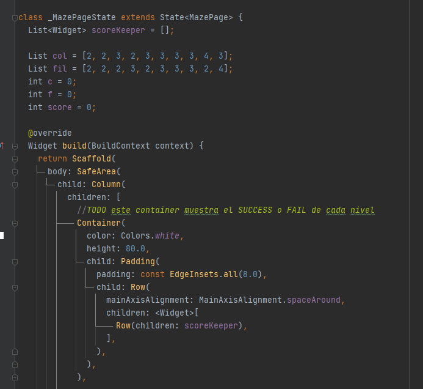
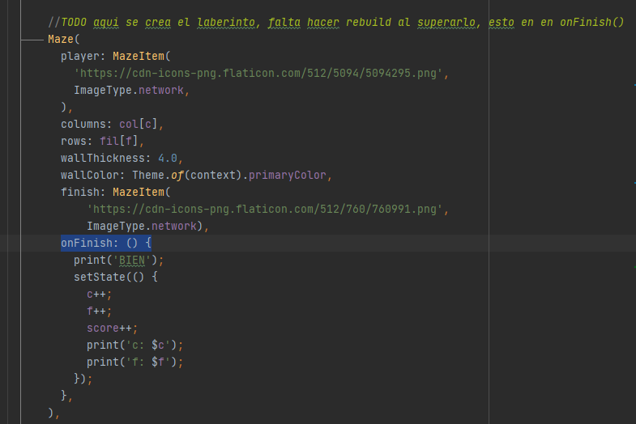

========================================================================================
col y fil se unen en cada iteracion para dar con el nuevo nivel
  col[0] fol[0] hace el Maze de primer nivel de dificultad
  col[1] fol[1] hace el Maze de segundo nivel de dificultad
  ...
  col[c] fol[f] hace el Maze de algun nivel de dificultad

usamos 'c' y 'f' con valor inicial de cero al empezar y este va aumentando en cada nivel

========================================================================================

al llegar a la meta, tanto 'c' como  'f' aumentan ++, pasando al siguiente nivel
y sumando un punto al SCORE del jugador

========================================================================================

EXITOS

# laberinto

A new Flutter project.

## Getting Started

This project is a starting point for a Flutter application.

A few resources to get you started if this is your first Flutter project:

- [Lab: Write your first Flutter app](https://flutter.dev/docs/get-started/codelab)
- [Cookbook: Useful Flutter samples](https://flutter.dev/docs/cookbook)

For help getting started with Flutter, view our
[online documentation](https://flutter.dev/docs), which offers tutorials,
samples, guidance on mobile development, and a full API reference.
